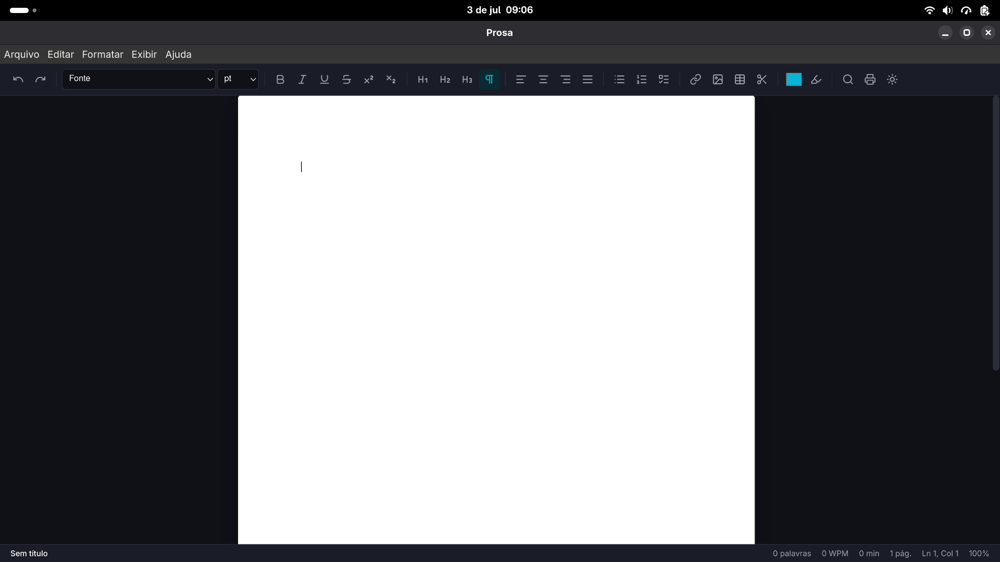

# Prosa

## Escreva. Formate. Publique

**Editor de texto moderno, open source e em modo escuro — parte da suíte de escritório Rodrigo Brito.**

[](LICENSE)


---

O **Prosa** é um processador de texto desktop construído com Electron e TypeScript,
com foco em uma experiência de uso moderna, modo escuro elegante e um código-fonte
limpo e tipado. Ele compete com o LibreOffice Writer e o Microsoft Word, mas com a
leveza e a estética de um editor atual.

O editor é construído sobre o [TipTap](https://tiptap.dev) (ProseMirror) e suporta
importação e exportação de `.docx`, Markdown, texto puro e PDF.



## ✨ Funcionalidades

- 📝 **Edição rica** — títulos (H1–H6), negrito, itálico, sublinhado, tachado,
  sobrescrito, subscrito, cores, realce, tamanhos e **todas as fontes
  instaladas no computador** (com pré-visualização no seletor).
- 📐 **Página A4 simulada** — área de edição com margens e dimensões reais.
- 🖼️ **Imagens** — inserir por arquivo, arrastar-e-soltar ou colar (embutidas
  no documento como base64).
- 📰 **Cabeçalho e rodapé** — bandas editáveis da página, salvas no documento,
  repetidas em todas as páginas na impressão/PDF e exportadas como cabeçalho e
  rodapé nativos do `.docx` (Word) e do `.odt` (LibreOffice).
- 📑 **Painel de tópicos** — outline automático dos títulos do documento, com
  navegação por clique.
- 🎨 **Estilos de parágrafo** — Normal, Títulos, Citação, Bloco de código.
- 🔍 **Localizar & Substituir** — com diferenciação de maiúsculas, palavra inteira
  e expressões regulares.
- ✅ **Corretor ortográfico** — sublinha palavras erradas (pt-BR e en-US) e, com
  o botão direito, mostra sugestões de correção e "adicionar ao dicionário".
- 🖨️ **Impressão** — diálogo de impressão do sistema (Ctrl+P) com saída em
  papel branco e texto preto.
- 🤖 **IA assistida** — suporte a OpenAI, Gemini, Claude, Mistral, Groq e Cohere
  para revisar, resumir, expandir, traduzir e reorganizar textos com confirmação
  explícita.
- 📊 **Barra de status** — contagem de palavras, caracteres, tempo de leitura,
  páginas, posição do cursor e zoom.
- 📥 **Importação** — `.docx` (Word), `.odt` (LibreOffice/OpenDocument),
  `.rtf`, `.doc` (Word 97-2003, somente leitura), Markdown e texto puro.
- 📤 **Exportação** — `.docx`, `.odt`, `.rtf`, Markdown, texto e PDF (printToPDF).
- 💾 **Formato nativo `.prosa`** — JSON com o documento TipTap e metadados.
- 🗂️ **Arquivos recentes** e tela de boas-vindas com arrastar-e-soltar.
- 🌙 **Modo escuro** dedicado, com a identidade visual da Rodrigo Brito.

## 📁 Compatibilidade de formatos

O Prosa abre e salva os formatos padrão do **Microsoft Office** e do
**LibreOffice**:

| Formato | Extensão | Abrir | Salvar | Origem |
| --- | --- | :---: | :---: | --- |
| Prosa (nativo) | `.prosa` | ✅ | ✅ | JSON (TipTap + metadados) |
| Word | `.docx` | ✅ | ✅ | Microsoft Office |
| OpenDocument Text | `.odt` | ✅ | ✅ | LibreOffice / OpenOffice |
| Rich Text | `.rtf` | ✅ | ✅ | Word e LibreOffice |
| Word 97-2003 | `.doc` | ⚠️ | — | Legado (leitura do texto) |
| Markdown | `.md` | ✅ | ✅ | — |
| Texto puro | `.txt` | ✅ | ✅ | — |
| PDF | `.pdf` | — | ✅ | Exportação (printToPDF) |

> ⚠️ O formato binário `.doc` (Word 97-2003) é obsoleto: o Prosa extrai o
> texto para leitura, mas a formatação rica não é preservada. Para editar,
> salve como `.docx` ou `.odt`. Formatos que não são documentos de texto
> (`.ods`, `.odp`, `.xlsx`, `.pptx`) não são abertos pelo Writer.

## ⌨️ Atalhos de teclado

| Ação | Atalho |
| --- | --- |
| Novo documento | `Ctrl+N` |
| Abrir | `Ctrl+O` |
| Salvar | `Ctrl+S` |
| Salvar como | `Ctrl+Shift+S` |
| Exportar PDF | `Ctrl+Shift+E` |
| Imprimir | `Ctrl+P` |
| Localizar | `Ctrl+F` |
| Substituir | `Ctrl+H` |
| Negrito | `Ctrl+B` |
| Itálico | `Ctrl+I` |
| Sublinhado | `Ctrl+U` |
| Título 1–6 | `Ctrl+Alt+1` … `Ctrl+Alt+6` |
| Ampliar / Reduzir / Restaurar zoom | `Ctrl++` / `Ctrl+-` / `Ctrl+0` |
| Alternar tópicos | `Ctrl+Shift+O` |
| Desfazer / Refazer | `Ctrl+Z` / `Ctrl+Y` |

> No macOS, use `Cmd` no lugar de `Ctrl`.

## 📦 Instalação

### Arch Linux

Publicado no AUR:

```sh
yay -S prosa
```

### openSUSE Leap, Fedora e Ubuntu/Debian

Nenhuma está nos repositórios oficiais ainda (nem OBS, nem Copr, nem PPA). O
mesmo instalador de conveniência serve as três — ele detecta a distro via
`/etc/os-release` e baixa o pacote certo (`.rpm` ou `.deb`) da release mais
recente:

```sh
curl -fsSL https://raw.githubusercontent.com/britors/Prosa/main/scripts/install.sh | sudo bash
```

Em openSUSE e Fedora baixa `prosa-<versão>.x86_64.rpm` (o mesmo RPM genérico
do `electron-builder` serve pras duas distros, ao contrário do Vega, que tem
specs separados) e instala via `zypper --allow-unsigned-rpm` / `dnf install
--nogpgcheck` (o RPM ainda não é assinado, sem chave GPG configurada). Em
Ubuntu/Debian baixa `prosa_<versão>_amd64.deb` e instala via `apt-get
install` (assim as dependências são resolvidas normalmente, ao contrário de
`dpkg -i`).

Para travar numa versão específica:
`PROSA_VERSION=v4.1.0 sudo -E bash install.sh` (baixe o script primeiro se
for usar essa variante).

### Windows

Baixe `Prosa-Setup-<versão>.exe` na página de
[**Releases**](https://github.com/britors/Prosa/releases) e rode o
instalador.

### Alternativa universal: AppImage

Baixe `Prosa-<versão>.AppImage` na página de
[**Releases**](https://github.com/britors/Prosa/releases), dê permissão de
execução e rode — não precisa instalar nem de root:

```sh
chmod +x Prosa-*.AppImage
./Prosa-*.AppImage
```

Os instaladores são gerados automaticamente pelo GitHub Actions a cada tag
`vX.Y.Z` (veja `.github/workflows/release.yml`).

## 🚀 Como compilar e executar

### Pré-requisitos

- [Node.js](https://nodejs.org) 20 ou superior
- npm 10 ou superior

### Passos

```bash
# 1. Instalar dependências
npm install

# 2. Compilar (main, preload e renderer via esbuild)
npm run build

# 3. Executar a aplicação
npm start
```

### Scripts disponíveis

| Script | Descrição |
| --- | --- |
| `npm run build` | Compila os bundles para `dist/`. |
| `npm run build:watch` | Compila e observa alterações. |
| `npm start` | Compila e abre o Prosa. |
| `npm run typecheck` | Verificação de tipos com `tsc --noEmit`. |
| `npm test` | Executa os testes com `node:test` + `tsx`. |
| `npm run test:e2e` | Executa integração/E2E do renderer com Electron. |
| `npm run dist` | Gera os instaladores com `electron-builder`. |

## 🧪 Testes

Os testes usam o runner nativo do Node (`node:test`) e cobrem importação/exportação
de `.docx` e Markdown, além das utilidades de contagem e extração de tópicos.

```bash
npm test
```

Para os fluxos críticos do renderer (Electron E2E):

```bash
npm run test:e2e
```

Em ambientes headless (CI/Linux sem display), execute com Xvfb:

```bash
xvfb-run -a npm run test:e2e
```

## 🏗️ Estrutura do projeto

```bash
src/
├── main/         # Processo principal do Electron (janela, menus, IPC, arquivos)
├── renderer/     # Interface: editor TipTap, barra de ferramentas, painéis, páginas
└── shared/      # Tipos e utilidades compartilhadas entre os processos
tests/            # Testes unitários (node:test)
```

## 🤝 Contribuindo

Contribuições são bem-vindas! Para contribuir:

1. Faça um fork do repositório e crie um branch a partir de `main`.
2. Mantenha o **TypeScript em modo estrito** — sem `any` desnecessário.
3. Adicione o cabeçalho de licença em todo arquivo novo:

   ```ts
   // Prosa — Editor de Texto
   // Copyright (C) 2026 Rodrigo Brito
   // SPDX-License-Identifier: GPL-3.0-or-later
   ```

4. Garanta que `npm run typecheck` e `npm test` passem.
5. Abra um Pull Request descrevendo a mudança.

O estilo de código segue o mesmo padrão do projeto
[Prisma4Postgres](https://github.com/britors/Prisma4Postgres).

## 📄 Licença

O Prosa é software livre, distribuído sob a licença
**GNU General Public License v3.0 ou posterior (GPL-3.0-or-later)**.

Este programa é distribuído na esperança de que seja útil, mas **SEM QUALQUER
GARANTIA**; sem mesmo a garantia implícita de COMERCIALIZAÇÃO ou ADEQUAÇÃO A UM
DETERMINADO FIM. Consulte a [GNU General Public License](LICENSE) para mais detalhes.

## 🏢 Sobre

Desenvolvido pela **Rodrigo Brito**.

- 🌐 Site: [https://github.com/britors/Prosa] [(https://github.com/britors/Prosa))
- 💻 GitHub: [github.com/britors/prosa](https://github.com/britors/prosa)
- ✉️ Suporte: [rodrigo@w3ti.com.br](mailto:rodrigo@w3ti.com.br)

© 2026 Rodrigo Brito
